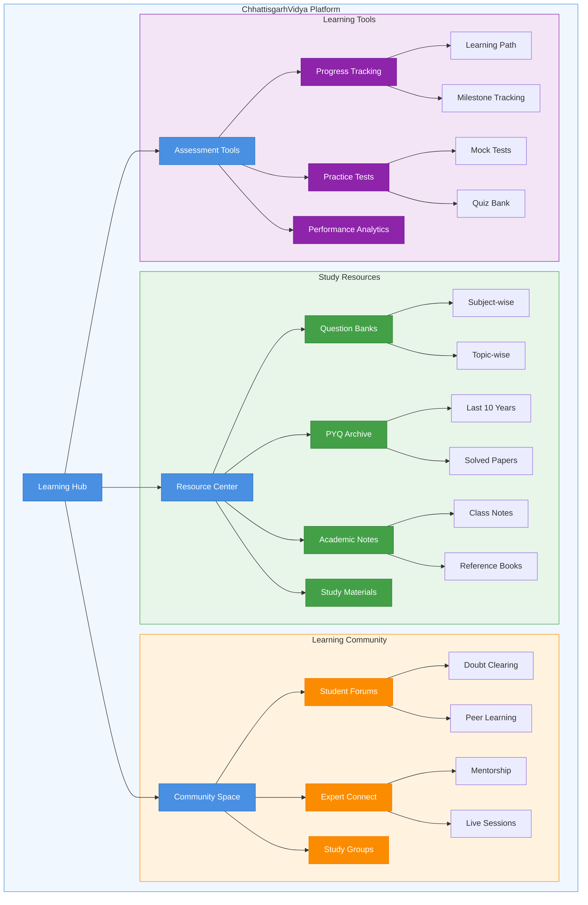

  
# 🚀 Welcome to Our Organization
  

## 🌟 Who We Are

We're a community of passionate developers building the future of technology. Our mission is to create innovative solutions that make a difference in the world.

## 💫 What We Do

## 🛠️ Our Tech Stack

  
  
  
  

## 🌱 Sustainability First

We're committed to sustainable technology. All our infrastructure runs on renewable energy, and we offset our carbon footprint.

  🌍 Net Zero Since 2024

Made with ❤️ by our community

